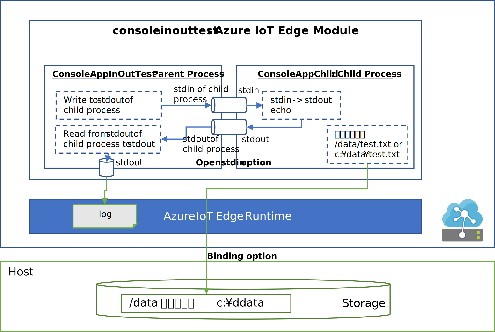

# AzureIoTEdgeModuleChildProcessStdInOutFilesSample
Azure IoT Edge Module - Child Process handling stdin/stdout and files sample
Azure IoT Edge Module 内で、Child Process を起動し、起動した Parent Process と Child Process 間の通信を stdin、stdout を通じて行う場合のサンプル。  
Child Process 側の stdout への出力を、IoT Edge Module のログで表示（デフォルトでは表示できない）したり、Parent Process と Child Process 間でのお手軽な双方向通信を行う（デフォルトだとこちらもできない）等に利用できるテクニック。  
加えて、Child Process からのホスト側のストレージへのアクセス（ファイルの保存等）のサンプルも含む。  
Linux 系の Docker と Windows 系の Docker でもまた微妙に設定が違うので、そちらのサンプルとしても有効。  
サンプルは、C#/.NET Core で作っているが、別の言語の場合でも、IoT Edge Module の起動オプションは利用可能なので、その場合でも有益のはず。  

---
## Architecture 
 

---
## サンプルの Build と Container Registry への Push 
IoT Edge Module(Doker Image のビルド方法は以下の通り。 
まずは、本リポジトリを開発環境に clone する。 
シェル上で、[source](./source) に移動する。  

### Linux の場合 
[source/ConsoleAppChild/Program.cs](./source/ConsoleAppChild/Program.cs) の、一行目の // を削除する。  
```C#
#define LINUX
using System;
using System.IO;

namespace ConsoleAppChild
{
```

Docker がインストールされた Linux の Shell 上で以下を実行  
※ Raspbian / Raspberry Pi を想定
```shell
$ sudo docker build -t consoleinouttest -f Dockerfile.linux-arm32v7 .
$ sudo docker tag consoleinouttest yourcontainer/consoleinouttest:1.0.0-arm32v7
$ sudo docker push yourcontainer/consoleinouttest:1.0.0-arm32v7
``` 
### Windows の場合
Docker for Desktop がインストールされた Windows 10 の Powershell 上で以下を実行  
```shell
> docker build -t consoleinouttest -f Dockerfile.windows-amd64 .
> docker tag consoleinouttest yourcontainer/consoleinouttest:1.0.0-arm32v7
> docker push yourcontainer/consoleinouttest:1.0.0-arm32v7
``` 
※ <i>yourcontainer</i> は、各自の Azure Container Registry のサーバーURL もしくは、Docker Hub の名前。  

---
## サンプルの Azure IoT Edge へのデプロイ  
Azure IoT Edge デバイスに、Build & Push した Docker Image を指定してデプロイする。  
Child Process の stdout への出力を Parent Process 側で受信するための重要な設定は、Deploy 指定時の Container Create Options での設定になるので漏れなく間違いなく設定していただきたい。  

### Linux 上の Azure IoT Edge デバイスにデプロイする場合  
事前に、/data というディレクトリを作成しておくこと。
```json
{
  "HostConfig": {
    "Binds": [
      "/data:/data"
    ]
  },
  "Config": {
    "OpenStdin": true
  }
}
```

### Windows 上の Azure IoT Edge デバイスにデプロイする場合  
事前に、c:\data というフォルダーを作成しておくこと。  
Docker for Desktop は、Windows Container に switch しておくこと。  
```json
{
  "HostConfig": {
    "Binds": [
      "c:\\data:c:\\data"
    ]
  },
  "Config": {
    "OpenStdin": true
  }
}
```
※ ホスト側のフォルダーのバインド指定の形式が Linux と Windows で異なるので注意。ファイルパスの形式の違いは、Dockerfile やロジック内でのファイルアクセスでも影響を受けるのでご注意。  

